# Wanderlust

## General information about the project

### Project name  
**Wanderlust**

### Project description  
Wanderlust is a modern web-based travel planning service that allows users to create personalized itineraries, find interesting places, explore other users' public itineraries, and build their own routes on an interactive map.

The platform is designed for ordinary travelers and travel agencies, providing everyone with tools for convenient travel planning and organization.

### Main features  
1. **Authorization and Registration**  
   - Registration with role selection:  
     - `User` (regular user).  
     - `Agency` (travel agency).  

2. **Functionality for different roles**  
   - **User:**  
     - Creating, editing, deleting routes.  
     - View created routes.  
     - Search for interesting places to add to routes using the following criteria:  
       - Name.  
       - Category.  
       - Location.  
     - Search and filter public routes.  
     - Saving public routes to personal ones, making changes to them.  
     - Exploring interesting places.  
     - Building routes on an interactive map.  
   - **Agency (travel agency):**  
     - Create, edit, delete public routes.  
     - View created routes.  
     - Search for interesting places to add to routes by criteria:  
       - Name.  
       - Category.  
       - Location.  
   - **Admin (administrator):**  
     - The functionality has not yet been developed.  

### Project technologies  
- **Frontend:** React TypeScript, Vite, Tailwind CSS, Redux Toolkit.  
- **Backend:** Node.js (TypeScript), SQLite.  

### Third-party APIs  
- **OpenTripMap API:** For searching for interesting places such as tourist attractions, landmarks or places to relax.  
  Documentation: https://dev.opentripmap.org/product  
- **Google Maps API:** For accurate route planning and construction.  
  Documentation: https://rapidapi.com/gmapplatform/api/google-map-places/  

### Interactive map  
- `react-leaflet`: For integrating a map into a web application.  
- `Cargo`: For improved geodata processing and route visualization.  

### Purpose  
Wanderlust is designed for travelers who want to conveniently organize their trips, as well as for travel agencies who want to share their itineraries and offer ready-made solutions to their clients.

### Target audience  
- Individual travelers.  
- Travel agencies.  

### Uniqueness of the project  
Wanderlust combines the ability to create personalized itineraries, map integration, and advanced search features to create the perfect travel tool, whether for beginners or experienced travelers or agencies.

## Project settings

### General requirements  
To deploy the Wanderlust project, you need to configure environment variables on the frontend and backend, ensure correct integration with the API, and start the server and client side.

1. **Environment variables (.env file):**  
   Create a `.env` file in the root directory and add the following variables:  
   ```env
   VITE_BASE_URL=http://localhost:8080 # Backend base URL
   VITE_ACCESS_EXP=15 # Access token validity period in minutes
   VITE_REFRESH_EXP=2520 # Refresh token expiration in minutes
   VITE_OPENTRIPMAP_APIKEY=your_api_key # API key for OpenTripMap
   VITE_GOOGLEMAP_APIKEY=your_api_key # API key for Google Maps
   ```
2. **Connecting environment variables:**  
    Environment variables in `Vite` are available via import.meta.env. For example:
    ```ts
    const baseUrl = import.meta.env.VITE_BASE_URL;
    ```

## Commands to run the frontend

### Installing dependencies
```bash
npm install
```
### Run in development mode:
```bash
npm run dev
```
### Assembly for production::
```bash
npm run build
```
### Open a browser and go to: http://localhost:5173

## Project structure

* **public**  
  Directory for static files.

* **src**  
  Main directory for the frontend.

  * **components**  
    Components used in the app.
  * **data**  
    Data or constants used on the frontend.
  * **hooks**  
    Custom React hooks.
  * **models**  
    TypeScript types and interfaces.
  * **pages**  
    Pages of the app.
  * **store**  
    Global app state managed with Redux Toolkit.
    * **api**  
      Logic for interacting with the API.
    * **slices**  
      Redux slices for state management.
    * **index.ts**  
      Redux store setup.
  * **App.tsx**  
    Main app file.
  * **main.tsx**  
    Entry point for rendering the React app.

* **.env**  
  Environment variables file for the frontend.

* **package.json**  
  Node.js project configuration with dependencies.

* **vite.config.ts**  
  Vite configuration for the project.

* **tailwind.config.js**  
  Tailwind CSS configuration.

* **tsconfig.json**  
  TypeScript configuration for the project.

## Application Screenshots

### Main Page
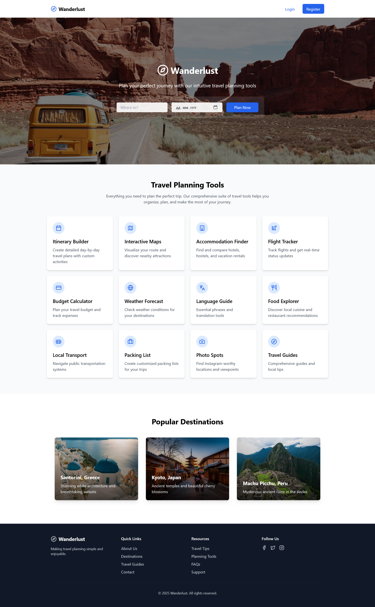

### Register Page
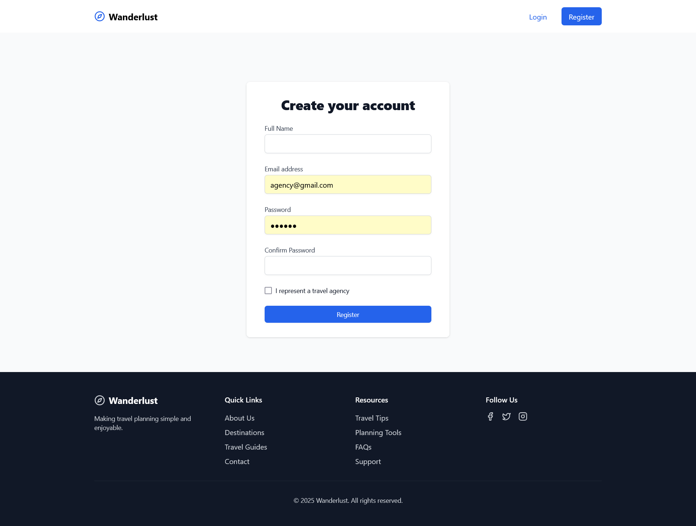

### Login Page
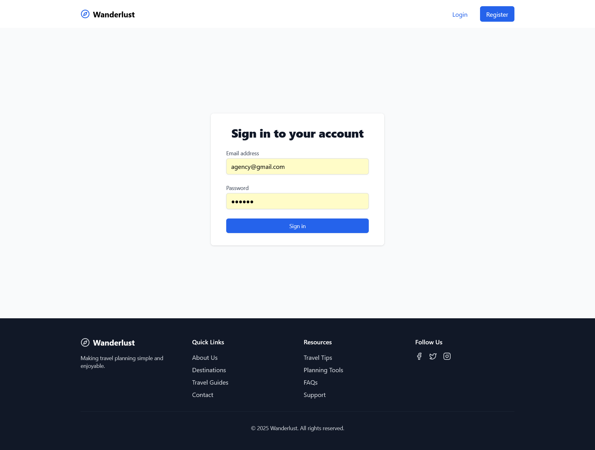

### Agency Home Page
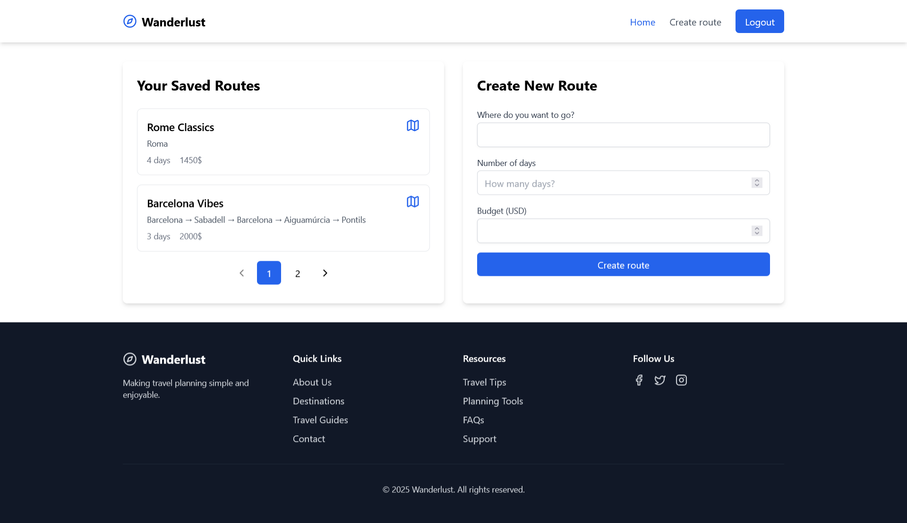

### Agency New Route Page
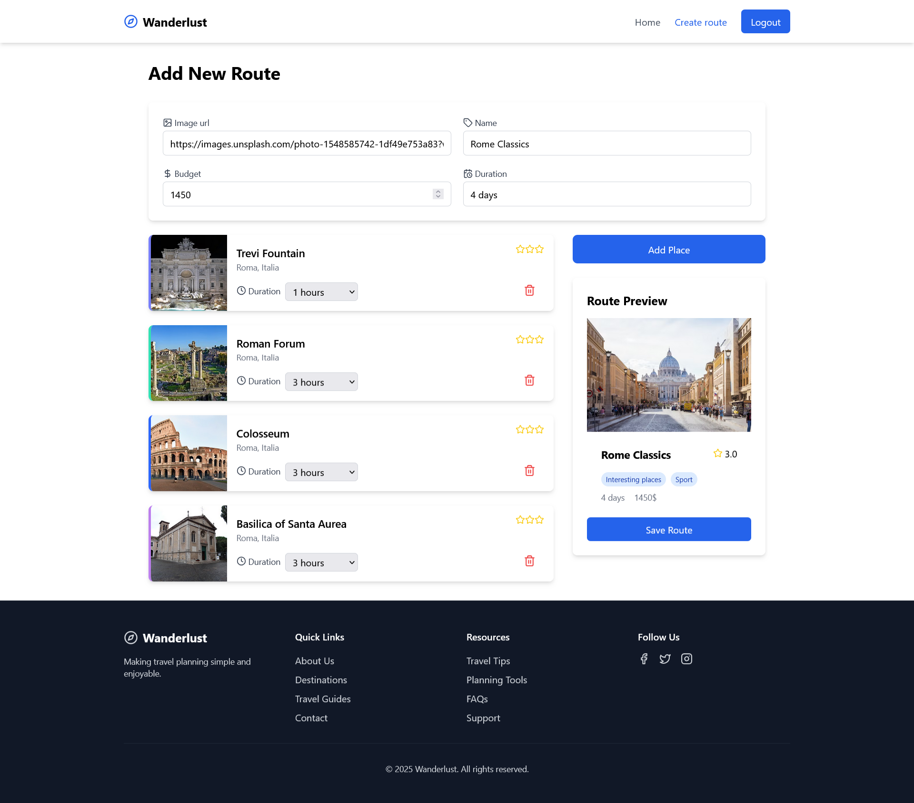

### Agency Route Page
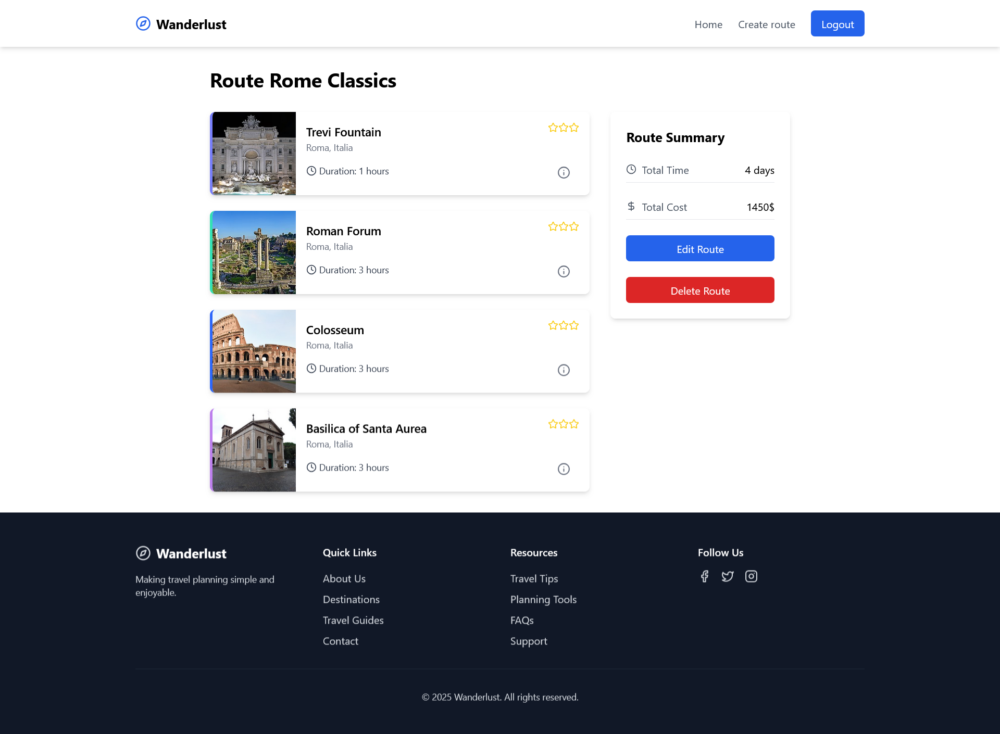

### Select Territory for Place Search
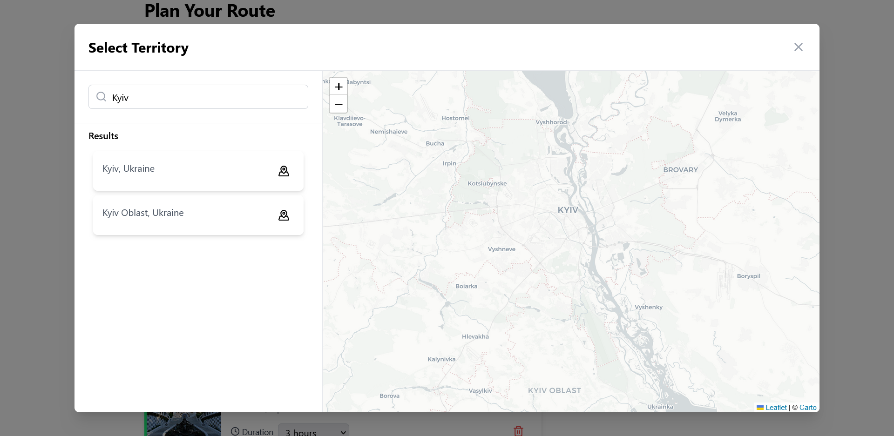

### Add Place to Route
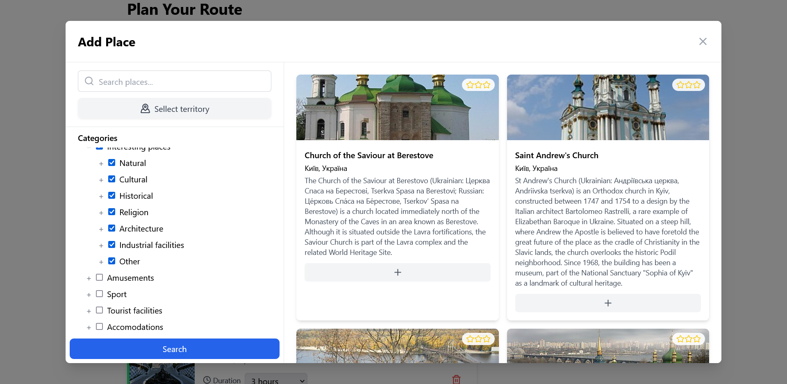

### User Home Page
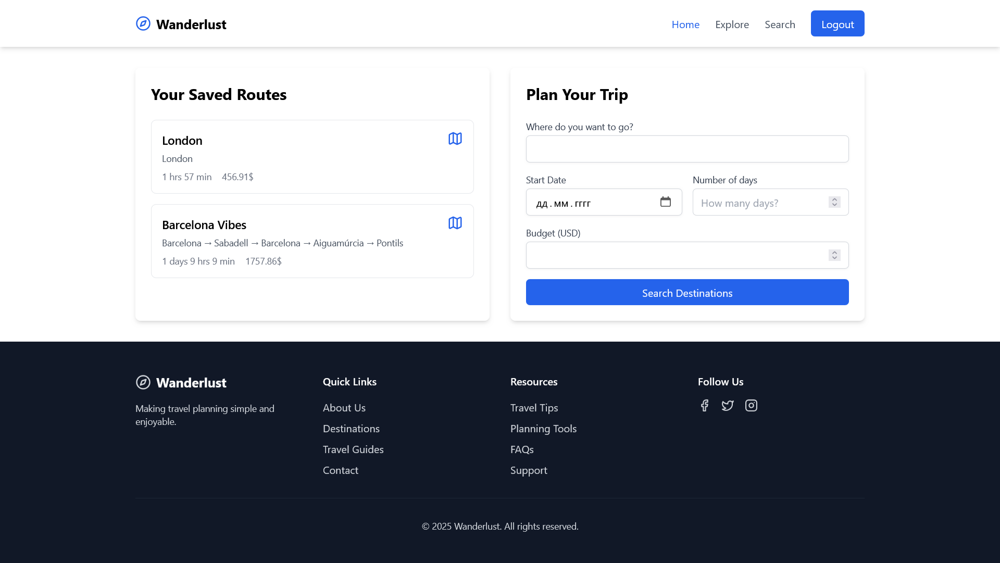

### Explore Page
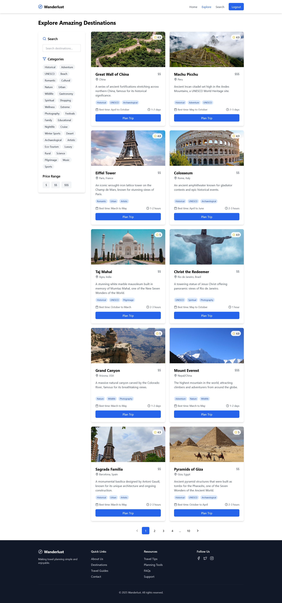

### Search Page
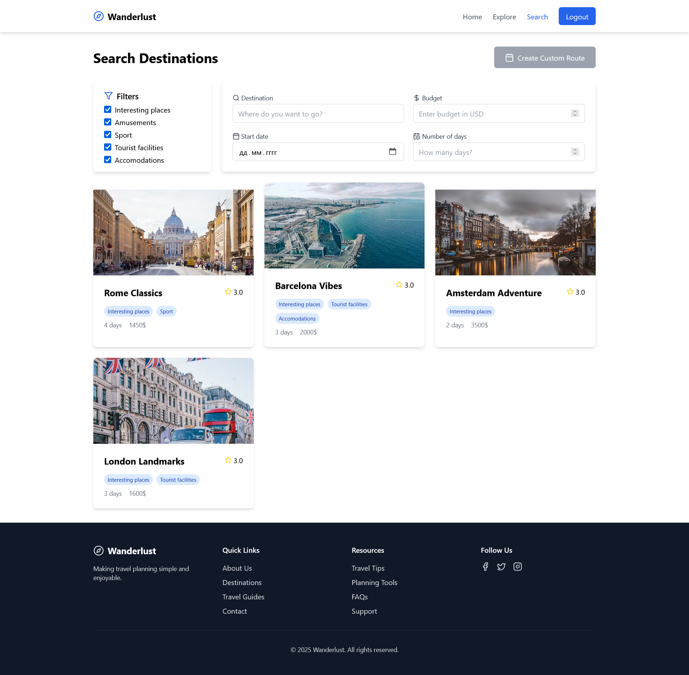

### User New Route Page
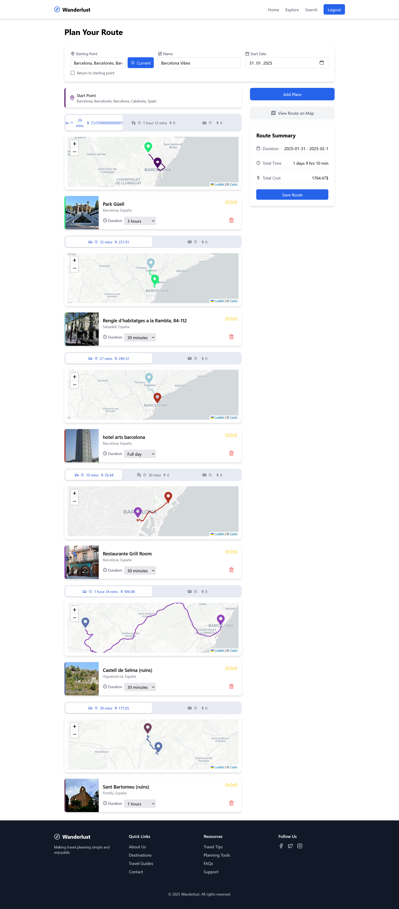

### Route on Map
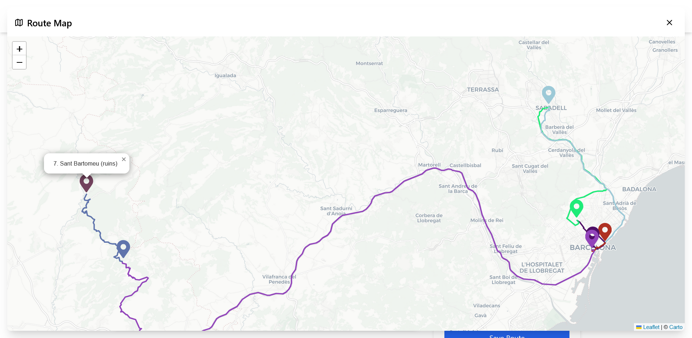

### User Route Page
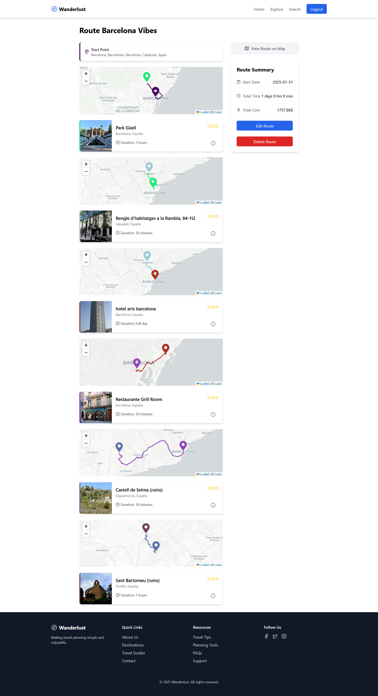
